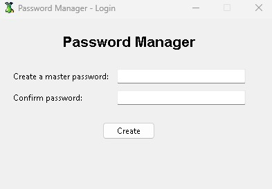
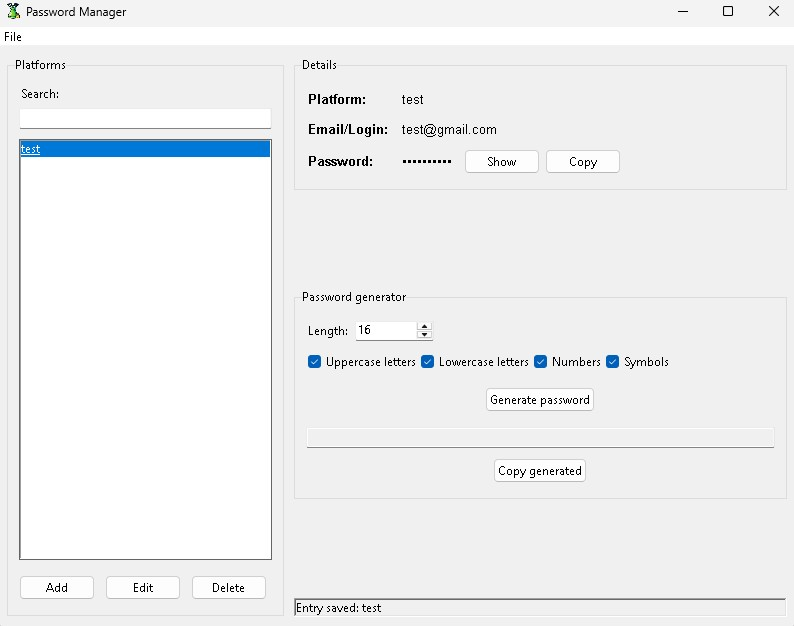

<p align="center"></p>

## Password Manager

Password Manager is a simple and secure password management tool written in Python. It allows you to store login credentials in an encrypted format, generate strong passwords. Using the cryptography library for encryption, your passwords remain protected, while the intuitive interface makes the program easy to use in daily life.


---

## Features

- 📜 **Password management** - save, view, and delete passwords.
- 🔑 **Secure password generation** - using `secrets` and `string`.
- 🔒 **Data encryption** - with `cryptography.Fernet`.
- 📋 **Automatic password copying** - to the clipboard `pyperclip`.
- 🎨 **User-friendly interface** - built with `tkinter`.

---

## Required libraries  
The application uses the following Python modules:

```python
import tkinter as tk
from tkinter import ttk, messagebox
import json
import os
import secrets
import string
import hashlib
import base64
import threading
import pyperclip
from cryptography.fernet import Fernet
from cryptography.hazmat.primitives import hashes
from cryptography.hazmat.primitives.kdf.pbkdf2 import PBKDF2HMAC
```

## Installation

1. Clone the repository

```bash
git clone https://github.com/DrTrefl/PasswordManager.git
cd PasswordManager
```

2. Install required libraries

```bash
pip install cryptography pyperclip
```

3.Run the application

```bash
python Password_Manager.py
```

---

## Screenshots

<p align="center"></p>
<p align="center"></p>

---

Thank you for your interest in my project.
